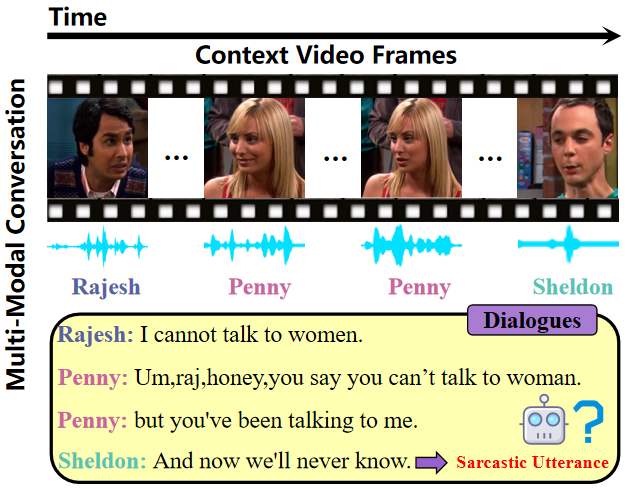

# 🤣👉MPF👈

😁This repository is the official codebase of "**MPF: A Multi-Level Perceiving Framework for Multimodal Sarcasm Detection**"
 
 
In the following, we will guide you how to use this repository step by step 🤗

## 🤓 Overview

  

## 📣Detailed steps:
1. First install the dependencies mentioned in the dependencies.txt.
2. Second store the dataset according to the specified path.

	**MUStARD** dataset--link:
	Text data - It is available at https://github.com/soujanyaporia/MUStARD in data/sarcasm_data.json location. We also provide train, valid and text dlog ids with them.
   Audio data - We first obtain raw video from https://github.com/soujanyaporia/MUStARD and convert those videos to audio format corresponding to the last utterance of every dialog. The we proceed to obtain audio features in the same manner as described in https://github.com/thuiar/MIntRec/tree/main/tools/audio_preprocess.py
  Video data - We get raws videos from https://github.com/soujanyaporia/MUStARD and obtain the video features corresponding to last utterance from https://github.com/soujanyaporia/MUStARD under Run the code section point 3 Download the pre-extracted visual features.
   **MUStARD++** dataset--link: [https://github.com/terenceylchow124/Meme-MultiModal?tab=readme-ov-file](https://github.com/cfiltnlp/MUStARD_Plus_Plus)
  **UR-FUNNY** dataset--link: https://github.com/ROC-HCI/UR-FUNNY  
4. Finally run framework_drive.ipynb, framework_drive_ablation_T-A view.ipynb, framework_drive_ablation_T-A-V view.ipynb, framework_drive_ablation_T-V view.ipynb
5. (Low resource migration testing can be conducted by setting the training size in the framework_drive.ipynb file）

